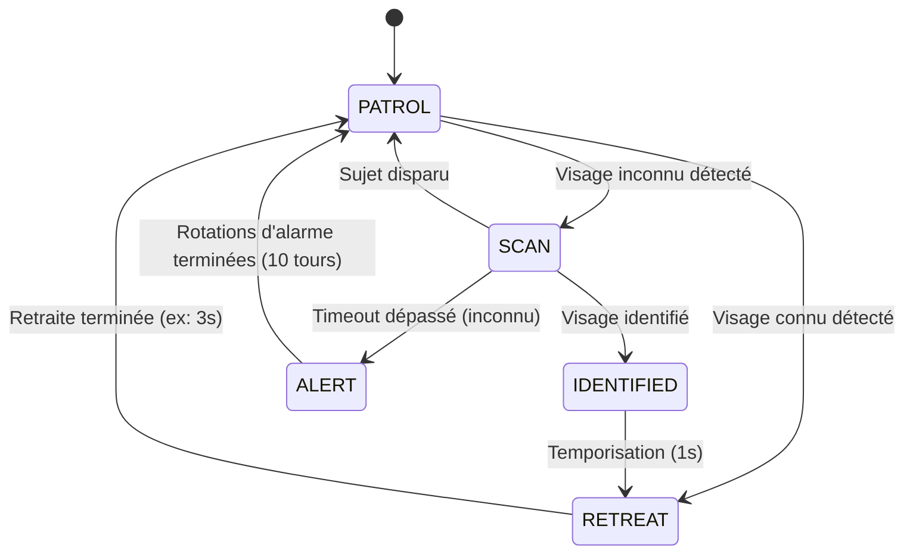

# Croquette — Robot de Surveillance & Reconnaissance Faciale

Bienvenue sur le projet **Croquette**, un robot mobile intelligent combinant vision par ordinateur temps réel, reconnaissance faciale et pilotage motorisé via microcontrôleur ESP32 / Arduino.

Le robot surveille son environnement, détecte les visages, identifie les personnes autorisées et adopte un comportement dynamique (salutation/retraite ou alerte d'intrusion) grâce à une machine à états finis (FSM).

---

## Fonctionnalités Principales

- **Flux Vidéo MJPEG Temps Réel** : Lecture multithreadée du flux vidéo de la caméra (ex: ESP32-CAM) sans bloquer la boucle de détection.
- **Détection & Reconnaissance Faciale Hybride** :
  - Détection ultra-rapide par **Google MediaPipe Face Detection** (optimisé pour courte portée < 2m).
  - Identification faciale par **OpenCV LBPH** (Local Binary Patterns Histograms) avec score de confiance paramétrable.
  - Estimation de la boîte corporelle et de la zone faciale.
- **Machine à États Finis (FSM)** :
  - `PATROL` : Surveillance active / patrouille libre.
  - `SCAN` : Arrêt automatique face à un visage inconnu pour analyse approfondie.
  - `IDENTIFIED` : Visage reconnu (ami / propriétaire).
  - `RETREAT` : Manœuvre de recul de courtoisie / sécurité après identification.
  - `ALERT` : Alarme visuelle et rotation défensive si un visage reste non identifié au-delà du temps limite.
- **Interface Graphique HUD (OpenCV)** :
  - Affichage en surimpression (Head-Up Display) avec statut courant, barre de progression animée lors du scan, cadrage des visages, alerte clignotante et monitoring du framerate (FPS).
- **Contrôle TCP du Châssis** : Communication par socket TCP avec l'ESP32 pour l'envoi direct des ordres de déplacement (`forward`, `backward`, `left`, `right`, `stop`).
- **Configuration Flexible** : Paramétrage simple et centralisé via fichier `.env`.

---

## Architecture du Projet

```
Croquette/
├── .env                    # Fichier de configuration des variables d'environnement
├── .gitignore              # Fichiers et dossiers exclus du suivi Git
├── requirements.txt        # Dépendances Python du projet
├── README.md               # Documentation complète du projet
├── known_faces/            # Dataset de photos pour l'entraînement
│   ├── Axel/
│   │   ├── photo1.jpg
│   │   └── photo2.jpg
│   └── Invité/
│       └── photo1.jpg
├── face_model.yml          # Modèle LBPH entraîné (généré)
├── face_labels.json        # Dictionnaire des labels/noms (généré)
└── src/
    ├── config.py           # Dataclass et chargeur de configuration (.env)
    ├── encode_faces.py     # Script d'apprentissage et génération du modèle
    ├── face_engine.py      # Moteur MediaPipe + OpenCV LBPH
    ├── gui_overlay.py      # Rendu graphique OpenCV (HUD, boîtes, alertes)
    ├── main.py             # Script principal de lancement
    ├── robot_controller.py # Client TCP pour envoyer les ordres à l'ESP32
    ├── state_machine.py    # Logique comportementale et transitions d'états
    └── stream_reader.py    # Thread de capture du flux MJPEG
```

---

## Machine à États (FSM)



---

## Prérequis

1. **Python** : Version 3.8 à 3.11 recommandée.
2. **Matériel** :
   - Robot équipé d'un microcontrôleur **ESP32** (ou combo ESP32-CAM + Arduino/driver moteur).
   - Caméra diffusant un flux MJPEG HTTP (ex: `http://192.168.4.1:81/stream`).
   - Serveur de commande TCP ouvert sur l'ESP32 (ex: port 80).
   - Ordinateur hôte connecté au même réseau WiFi que le robot (ou à son point d'accès).

---

## Installation

### 1. Cloner le dépôt et se placer dans le projet

```bash
git clone https://github.com/Axel-Bouchery/Croquette.git
cd Croquette
```

### 2. Créer et activer un environnement virtuel (recommandé)

Sous Windows (PowerShell) :
```powershell
python -m venv venv
.\venv\Scripts\Activate.ps1
```

Sous Linux / macOS :
```bash
python3 -m venv venv
source venv/bin/activate
```

### 3. Installer les dépendances

```bash
pip install -r requirements.txt
```

---

## Configuration (`.env`)

Créez ou adaptez le fichier `.env` à la racine du projet :

```ini
# IP de l'ESP32 (adresse par défaut en mode Point d'Accès ESP32)
ROBOT_IP=192.168.4.1

# Port du flux vidéo MJPEG
ROBOT_STREAM_PORT=81

# Port du serveur de commandes TCP
ROBOT_COMMAND_PORT=80

# Temporisations et comportement (secondes)
SCAN_TIMEOUT=5.0
ALERT_ROTATIONS=10
RETREAT_DURATION=3.0

# Tolérance LBPH (plus bas = plus strict, typiquement entre 60 et 90)
FACE_CONFIDENCE_THRESHOLD=80.0

# Fichiers et dossiers du modèle
KNOWN_FACES_DIR=known_faces
MODEL_PATH=face_model.yml
LABELS_PATH=face_labels.json

# Optimisations de performances
FRAME_SKIP=3
RESIZE_FACTOR=4
```

---

## Entraînement de la Reconnaissance Faciale

Avant de lancer le système autonome, il faut apprendre les visages à reconnaître :

1. Créez un sous-dossier par personne dans `known_faces/` :
   ```
   known_faces/
   ├── Axel/
   │   ├── photo1.jpg
   │   ├── photo2.jpg
   │   └── photo3.jpg
   └── Alice/
       ├── 01.jpg
       └── 02.jpg
   ```
   > **Conseils photos** : Ajoutez entre 5 et 15 photos variées par personne (angles de tête légers, expressions différentes, conditions lumineuses diverses) avec le visage bien visible.

2. Lancez l'apprentissage :
   ```bash
   python -m src.encode_faces
   ```
   Le script génère automatiquement `face_model.yml` et `face_labels.json`.

---

## Lancement & Contrôles

Pour démarrer la surveillance et le pilotage du robot :

```bash
python -m src.main
```

### Raccourcis Clavier (dans la fenêtre vidéo)

| Touche | Action |
|---|---|
| `q` ou `Échap` | Quitter l'application proprement et arrêter les moteurs |
| `s` | Prendre une capture d'écran (`screenshot_<timestamp>.jpg`) |
| `r` | Réinitialiser la machine à états (force le retour en mode `PATROL`) |
| `p` | Mettre en pause / reprendre l'analyse faciale |

---

## Protocole de Commande TCP du Robot

Le contrôleur envoie des chaînes de caractères encodées en UTF-8 terminées par un saut de ligne (`\n`) :

- `forward\n` : Avancer
- `backward\n` : Reculer
- `left\n` : Pivoter à gauche
- `right\n` : Pivoter à droite
- `stop\n` : Arrêt des moteurs

---

## Dépannage Fréquent

- **`[Erreur] Impossible de récupérer le flux vidéo après 10 secondes`** :
  - Vérifiez que vous êtes bien connecté au réseau WiFi du robot.
  - Testez l'URL du flux dans un navigateur : `http://192.168.4.1:81/stream`.
  - Vérifiez l'adresse IP et le port dans votre fichier `.env`.

- **`[Attention] Échec de connexion au robot, poursuite en mode caméra seule`** :
  - Le serveur TCP sur le port 80 de l'ESP32 n'est pas joignable. Le programme continue de fonctionner pour la vision et l'affichage vidéo, mais n'actionnera pas les roues.

- **Le visage est détecté mais marqué "Inconnu" même s'il est entraîné** :
  - Ajustez la valeur de `FACE_CONFIDENCE_THRESHOLD` dans `.env` (ex: augmentez à 85-90 si la reconnaissance est trop stricte).
  - Ajoutez davantage de clichés sous différents angles dans `known_faces/` puis relancez `python -m src.encode_faces`.

- **Framerate faible / saccades** :
  - Augmentez `FRAME_SKIP` (ex: `4` ou `5`) pour analyser moins souvent les visages.
  - Augmentez `RESIZE_FACTOR` (ex: `4` ou `6`) pour sous-échantillonner l'image lors de la détection MediaPipe.

---

## Licence

Projet développé pour le robot **Croquette**. Distribué sous licence libre d'utilisation pour des projets d'apprentissage et de robotique personnelle.
