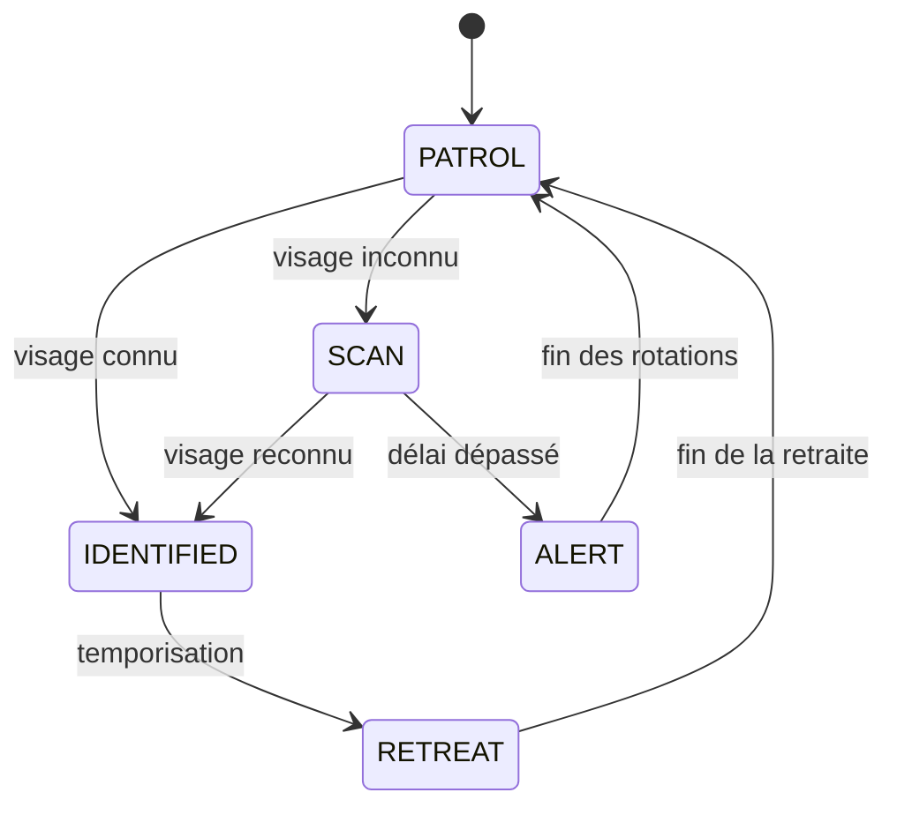

# Croquette

Robot de surveillance et d'interaction visuelle basé sur Python, OpenCV et la reconnaissance faciale.

## Sommaire

- [Présentation](#présentation)
- [Fonctionnalités](#fonctionnalités)
- [Architecture du projet](#architecture-du-projet)
- [Prérequis](#prérequis)
- [Installation](#installation)
- [Configuration](#configuration)
- [Entraînement du modèle](#entraînement-du-modèle)
- [Lancement](#lancement)
- [Contrôles clavier](#contrôles-clavier)
- [Dépannage](#dépannage)
- [Licence](#licence)

## Présentation

Croquette est un projet de robot autonome qui combine :

- lecture d'un flux vidéo en temps réel,
- détection de visages,
- reconnaissance faciale,
- machine à états pour piloter un comportement de surveillance,
- interface visuelle OpenCV avec HUD,
- commande TCP vers un robot ou un microcontrôleur.

Le but est de surveiller un environnement, identifier les visages connus, et adapter le comportement du robot selon le contexte : patrouille, analyse, identification, recul ou alerte.

Le projet inclut aussi une animation visuelle de licorne sur l'écran, ajoutée en overlay pendant la lecture de la caméra.

## Fonctionnalités

- Détection de visages via MediaPipe et/ou Haar Cascade OpenCV.
- Reconnaissance faciale avec LBPH OpenCV.
- Chargement d'un modèle entraîné depuis des dossiers `known_faces/`.
- Machine à états : `PATROL`, `SCAN`, `IDENTIFIED`, `RETREAT`, `ALERT`.
- Lecture d'un flux MJPEG en temps réel.
- Affichage visuel avec boîtes de détection, labels, état actuel et FPS.
- Commande TCP des moteurs du robot via une socket.
- Overlay d'animation de licorne lorsqu'un visage est détecté ou pendant la promenade.
- Configuration centralisée via `.env`.

## Architecture du projet

```text
Croquette/
├── .env
├── .gitignore
├── README.md
├── requirements.txt
├── known_faces/
│   ├── Axel/
│   │   ├── photo1.jpg
│   │   └── ...
│   └── AutrePersonne/
│       └── ...
├── face_model.yml
├── face_labels.json
├── assets/
│   └── unicorn.png
├── src/
│   ├── config.py
│   ├── encode_faces.py
│   ├── face_engine.py
│   ├── gui_overlay.py
│   ├── main.py
│   ├── robot_controller.py
│   ├── state_machine.py
│   └── stream_reader.py
└── tests/
```

## Prérequis

- Python 3.9+ recommandé
- Caméra MJPEG accessible via HTTP (par exemple un flux ESP32-CAM)
- Un robot ou un périphérique avec serveur TCP si l'on veut activer le pilotage moteur
- Réseau local compatible avec la caméra / robot

## Installation

### 1. Cloner le dépôt

```bash
git clone https://github.com/Axel-Bouchery/Croquette.git
cd Croquette
```

### 2. Créer un environnement virtuel

Linux / macOS :

```bash
python3 -m venv .venv
source .venv/bin/activate
```

Windows PowerShell :

```powershell
python -m venv .venv
.\.venv\Scripts\Activate.ps1
```

### 3. Installer les dépendances

```bash
pip install -r requirements.txt
```

## Configuration

Créez un fichier `.env` à la racine du projet si ce n'est pas déjà présent.

Exemple :

```ini
ROBOT_IP=192.168.4.1
ROBOT_STREAM_PORT=81
ROBOT_COMMAND_PORT=80

SCAN_TIMEOUT=5.0
ALERT_ROTATIONS=10
RETREAT_DURATION=3.0

FACE_CONFIDENCE_THRESHOLD=80.0
KNOWN_FACES_DIR=known_faces
MODEL_PATH=face_model.yml
LABELS_PATH=face_labels.json

FRAME_SKIP=3
RESIZE_FACTOR=4
```

### Paramètres importants

- `ROBOT_IP` : adresse IP du robot ou du module de commande
- `ROBOT_STREAM_PORT` : port du flux vidéo MJPEG
- `ROBOT_COMMAND_PORT` : port TCP pour la commande des moteurs
- `FACE_CONFIDENCE_THRESHOLD` : seuil de seuil pour la reconnaissance faciale. Plus le nombre est bas, plus la tolérance est stricte.
- `FRAME_SKIP` : fréquence d'analyse des images
- `RESIZE_FACTOR` : réduction de taille avant détection pour améliorer les performances

## Entraînement du modèle

Avant d'utiliser la reconnaissance faciale, il faut ajouter des visages à reconnaître.

### Structure attendue

```text
known_faces/
├── Axel/
│   ├── photo1.jpg
│   ├── photo2.jpg
│   └── photo3.jpg
├── Jules/
│   ├── photo1.jpg
│   └── photo2.jpg
└── ...
```

### Lancer l'entraînement

```bash
python -m src.encode_faces
```

Cela va générer :

- `face_model.yml`
- `face_labels.json`

## Lancement

Pour démarrer le programme principal :

```bash
python -m src.main
```

Le programme va :

1. charger la configuration,
2. ouvrir le flux vidéo,
3. initialiser le moteur de détection,
4. connecter le robot si possible,
5. afficher le flux video avec les annotations et la licorne animée.

## Contrôles clavier

Dans la fenêtre OpenCV :

| Touche | Action |
|---|---|
| `q` ou `Esc` | Quitter le programme |
| `s` | Prendre une capture d'écran |
| `r` | Réinitialiser la machine à états |
| `p` | Mettre en pause / reprendre l'analyse |

## Comportement du robot

Le système suit une machine à états :



### États

- `PATROL` : surveillance et déplacement libre
- `SCAN` : analyse d'un visage inconnu
- `IDENTIFIED` : identification réussie
- `RETREAT` : recul/maintien de distance
- `ALERT` : alarme visuelle et rotation défensive

## Dépannage

### Le flux vidéo ne démarre pas

- Vérifiez la connexion réseau au robot
- Testez le flux dans un navigateur : `http://IP:PORT/stream`
- Vérifiez `ROBOT_STREAM_PORT` dans le `.env`

### Le robot ne répond pas

- Vérifiez `ROBOT_IP` et `ROBOT_COMMAND_PORT`
- Le programme continue souvent en mode caméra seule si la connexion TCP échoue

### Les visages ne sont pas reconnus

- Vérifiez la qualité et le nombre des images dans `known_faces/`
- Relancez `python -m src.encode_faces`
- Ajustez `FACE_CONFIDENCE_THRESHOLD`

### Le programme est lent

- Augmentez `FRAME_SKIP`
- Augmentez `RESIZE_FACTOR`
- Réduisez la taille de la fenêtre ou la fréquence d'analyse

## Licence

Projet personnel / expérimental de robotique et vision par ordinateur.

Le code est fourni à titre éducatif et peut être adapté librement pour des usages personnels ou de démonstration.

---

Ce README est conçu pour refléter l'état actuel du projet : robot de surveillance, détection faciale, interface OpenCV, commande robotique et animation de licorne en overlay.
